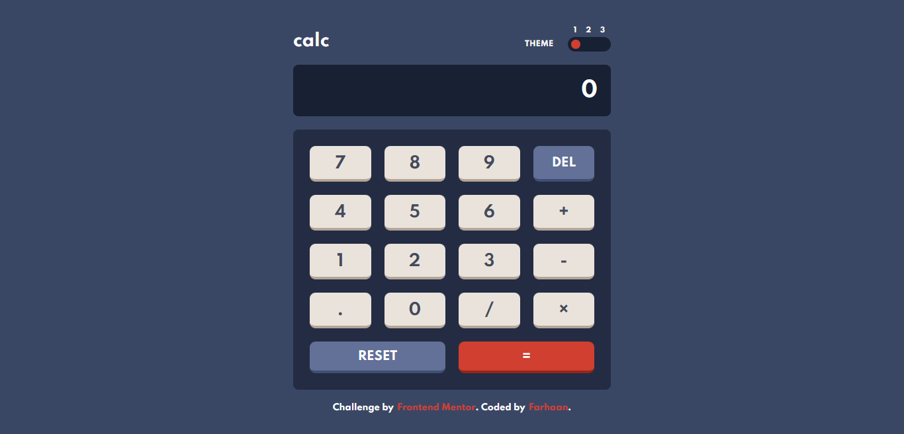
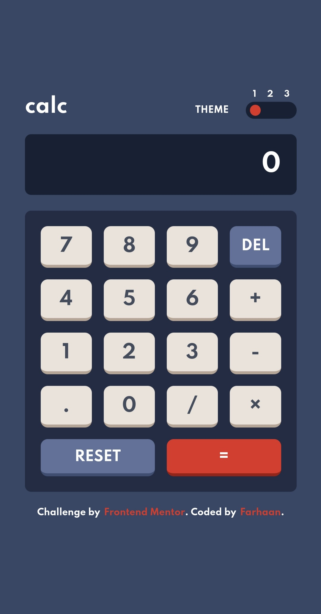

# Frontend Mentor - Calculator app solution

This is a solution to the [Calculator app challenge on Frontend Mentor](https://www.frontendmentor.io/challenges/calculator-app-9lteq5N29). Frontend Mentor challenges help you improve your coding skills by building realistic projects. 

## Table of contents

  - [Overview](#overview)
    - [The challenge](#the-challenge)
    - [Links](#links)
    - [Screenshots](#screenshots)
  - [My process](#my-process)
    - [Built with](#built-with)
    - [Useful resources](#useful-resources)
  - [Author](#author)

## Overview

### The challenge

Users should be able to:

- See the size of the elements adjust based on their device's screen size
- Perform mathmatical operations like addition, subtraction, multiplication, and division
- Adjust the color theme based on their preference
- **Bonus**: Have their initial theme preference checked using `prefers-color-scheme` and have any additional changes saved in the browser

### Links

- [GitHub repo](https://github.com/Farhaan9082/calculator-app)
- [Live Site URL](https://calculator-app-cyan.vercel.app/)

### Screenshots
- Desktop

- Mobile

## My process

### Built with

- Semantic **HTML5** markup
- **CSS**
- Flexbox
- CSS Grid
- [Svelte](https://svelte.dev/) - Web framework
- [Vercel](https://vercel.com/) - Deployment

### Useful resources

- [Deploy Svelte with Vercel](https://vercel.com/guides/deploying-svelte-with-vercel)

## Author

- Frontend Mentor - [@Farhaan](https://www.frontendmentor.io/profile/Farhaan9082)